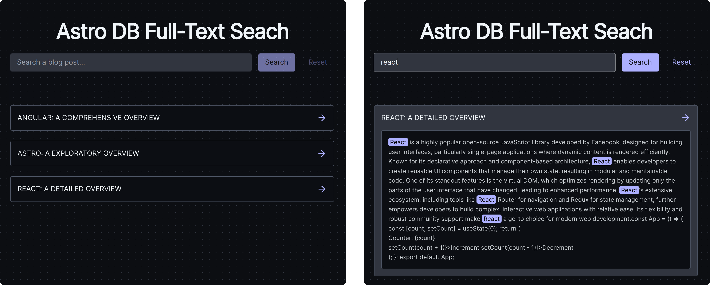

# Full Text Search with Astro DB

This demo project showcases a full-text search solution using [Astro DB][astrojs-db] and SQLite's [FTS5][fts5] virtual
table module.

It provides a batteries-included solution for searching a collection of blog posts using:

- [FTS5 Virtual Table Module][fts5]
- [Astro DB][astrojs-db]
- [Astro Page Partials][astrojs-partial]
- [Astro Hybrid Rendering][astrojs-hybrid]
- [Tailwind CSS][tailwindcss]
- [Alpine.js][alpinejs]

It also offers solutions for seeding both local and production databases.

For more information, check out my blog post on the topic at [christianpenrod.com][post].

<br/>



<br/>

## Getting Started

1. Install dependencies:
   ```sh
   pnpm install
   ```
2. Start the development server:
   ```sh
    pnpm dev
   ```
3. Open the browser and navigate to `http://localhost:4321`.

[post]: https://christianpenrod.com/blog/full-text-search-with-astro-db
[fts5]: https://www.sqlite.org/fts5.html
[astrojs-db]: https://docs.astro.build/en/guides/astro-db/
[astrojs-hybrid]: https://docs.astro.build/en/guides/server-side-rendering/#opting-out-of-pre-rendering-in-hybrid-mode
[astrojs-partial]: https://docs.astro.build/en/basics/astro-pages/#page-partials
[tailwindcss]: https://tailwindcss.com/
[alpinejs]: https://alpinejs.dev/
